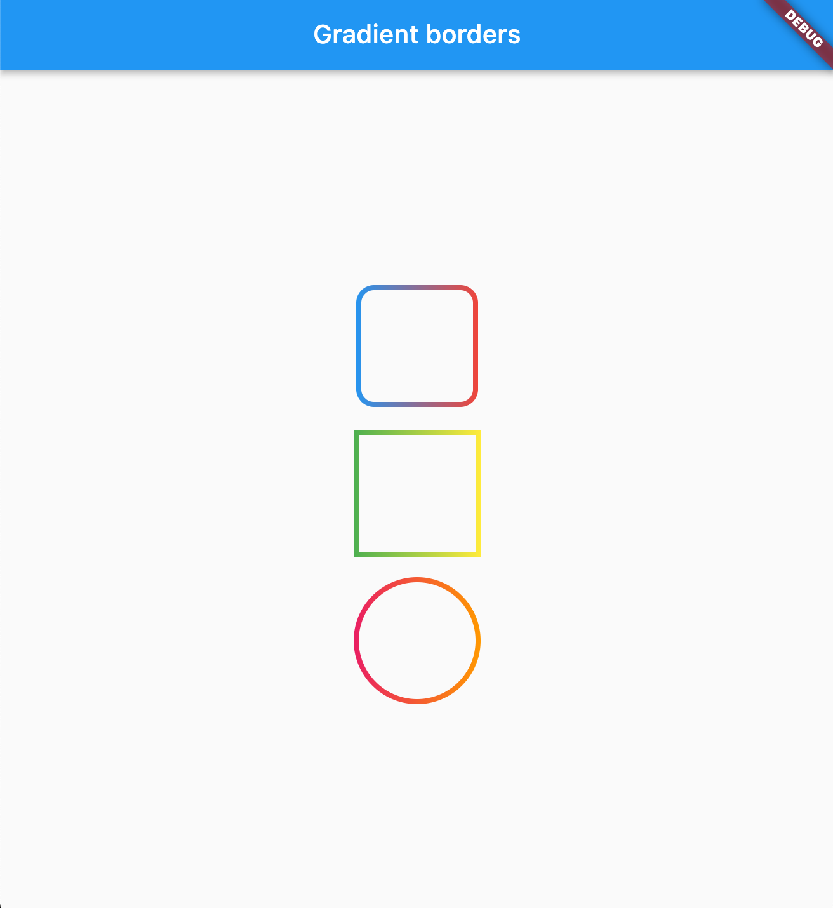
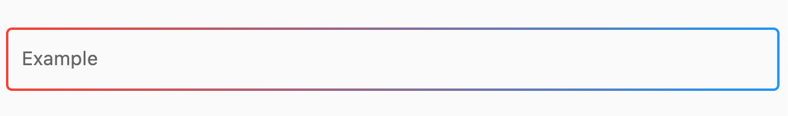

# Gradient borders
[](https://pub.dev/packages/very_good_analysis)

Various borders that use gradient instead of boring plain colors.

## Usage

### Box borders:

Change your container borders to use fancy gradients:
```dart
Container(
  width: 100,
  height: 100,
  decoration: BoxDecoration(
    border: const GradientBoxBorder(
      gradient: LinearGradient(colors: [Colors.blue, Colors.red]),
      width: 4,
    ),
    borderRadius: BorderRadius.circular(16)
  ),
),
```
Works with both: border radius, and with `BoxShape.circle`



### Input borders
You can use `GradientOutlineInputBorder` as a part of your input decoration:
```dart
TextField(
  decoration: InputDecoration(
    border: GradientOutlineInputBorder(
      gradient: LinearGradient(colors: [Colors.red, Colors.blue]),
      width: 2,
    ),
    focusedBorder: GradientOutlineInputBorder(
     gradient: LinearGradient(colors: [Colors.yellow, Colors.green]),
      width: 2
    ),
    label: Text("Example"),
  ),
),
```



You can also use `GradientUnderlineInputBorder` as part of your input decoration:
```dart
TextField(
  decoration: InputDecoration(
    border: GradientOutlineInputBorder(
      gradient: LinearGradient(colors: [Colors.red, Colors.blue]),
      width: 2,
    ),
    focusedBorder: GradientUnderlineInputBorder(
     gradient: LinearGradient(colors: [Colors.yellow, Colors.green]),
      width: 2
    ),
    label: Text("Example"),
  ),
),
```

### Sponsored by
[The Code Brothers](https://thecodebrothers.pl)
